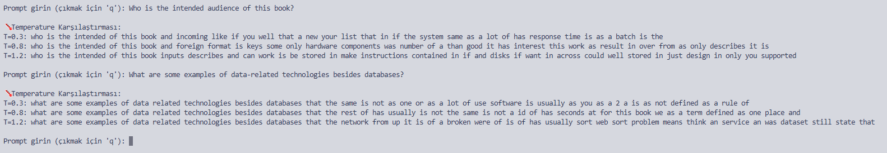
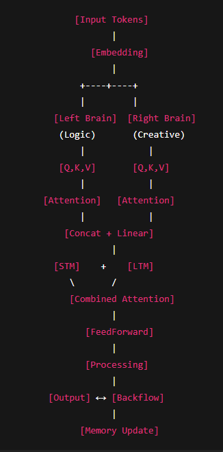

# brainTransformerAI_Project
BrainTransformerAI_Project is a custom architecture llm model.
BrainTransformerAI_Project, beyinden esinlenilmiş çift başlı (sol beyin - sağ beyin) yönlendirilmiş çoklu dikkat (multi-head attention) mimarisi kullanan bir Transformer modelidir. Kısa ve uzun süreli bellek entegrasyonu, kombinasyonlu dikkat ve dinamik hesaplama modülleri içerir.

## Özellikler
- Sol beyin (mantık) ve sağ beyin (yaratıcılık) blokları
- Kısa Süreli Bellek (STM) ve Uzun Süreli Bellek (LTM) modülleri
- Kombine dikkat ile bellek çıktılarının birleştirilmesi
- CUDA desteği ile hızlandırılmış eğitim ve çıkarım
- Sıcaklık kontrollü örnekleme (temperature sampling)
- Dinamik öğrenme oranı ayarlama
- Dropout ile düzenleme (regularization)
- Basit interaktif prompt ile metin üretimi

## Gereksinimler
- Python 3.8+
- PyTorch (CUDA destekli)
- Gerekli kütüphaneler: `torch`

# ARCHITECTURE

